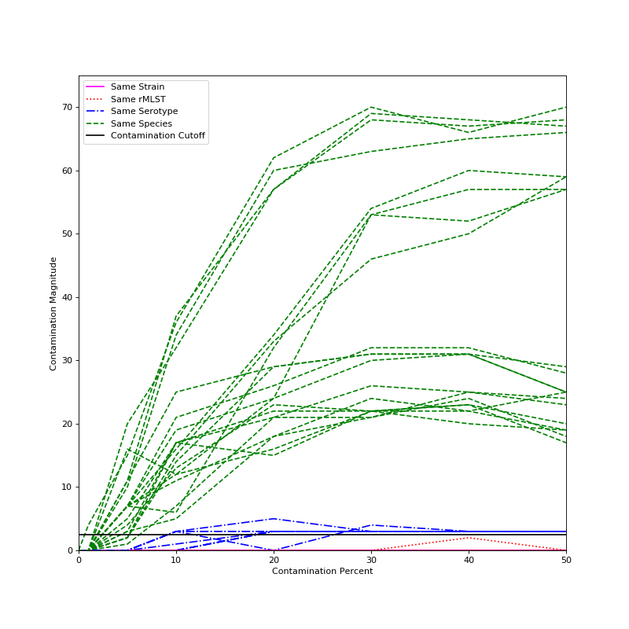

# What is ConFindr?

ConFindr is a pipeline that can detect contamination in bacterial NGS data, both between and within species. It can do this with pretty darn good sensitivity - two samples mixed together with as few as
500 SNPs between them (> 99.9 percent identity!) can be identified. This allows for stringent quality control of NGS samples.

### How Does ConFindr Work?

ConFindr works by looking at conserved core genes - either using rMLST genes (53 genes are known to be single copy and conserved across all bacteria with some known exceptions, which ConFindr handles), or 
 custom sets of genes derived from core-genome schemes. As the genes ConFindr looks at are single copy, any sample that has multiple alleles of one or more gene is likely to be contaminated. 
To identify the presence of multiple alleles in a sample, the following workflow is followed:

1. Use Mash to determine the genus of each sample so that genus-specific databases can be constructed
and check for interspecies contamination.
2. Perform stringent quality trimming and bait out reads that contain rMLST gene sequence, using BBDuk.
3. Align reads back to the rMLST genes.
4. Look at the alignment to find `Contaminating SNVs` - those that have sites where more than one base is present, indicating
that multiple alleles are present, indicating contamination.

### Limits of Detection

#### Intraspecies

The limit of detection for ConFindr is going to be a function of several factors, so it's hard to give
exact information on what can and can't be detected. However, here are a few guidelines:

- Two strains with identical rMLST genes won't ever have contamination detected between them. 
- ConFindr has a cutoff of finding 3 `Contaminating SNVs` found for calling a sample as contaminated, as
there will occasionally be 1 false positive, and very rarely 2 false positive sites. In practice, this still lets you detect
contamination essentially whenever two strains have different rMLST types, as >99 percent of types have
at least 3 SNPs between them in _E. coli_, _S. enterica_, and _L. monocytogenes_. I haven't looked at other
species in detail, but this very likely holds true for them too.
- The degree of contamination matters: things with very low levels of contamination (around 1 percent) probably
won't ever be picked up under default parameters. Once you hit 5 percent contamination, whether or not it gets
detected is a function of sequencing depth and distance between species.
- Sequencing depth matters: `Contaminating SNVs` are found more reliably the more depth you have. ConFindr seems
to work pretty well once you hit 40X or 50X, but trying to run it on a sample with only 10X coverage is unlikely to ever
find anything (unless default parameters get changed)
- Relatedness of the contaminant strain is the the final major factor - with something very closely related to the
strain you actually want, picking up contamination at 5 percent will be pretty difficult.

The below graph shows the magnitude of contamination detected for several synthetic datasets in *Escherichia coli*.
Strains were mixed together that were either identical (and so should have no contamination), not identical but
have the same rMLST type (and so are contaminated, but beyond the limit of detection), two strains with the same serotype,
and therefore very closely related, or two strains of differing serotypes.

The black line on the graph represents our cutoff for contaminated samples - any sample with a magnitude above that
can reliably be called contaminated. As can be seen, two different serotypes from the same species are reliably detected
at contamination levels of 5 percent or higher, two strains of the same serotype are often detected at 10 percent
contamination and almost always at 20 percent contamination, and two strains that have the same rMLST or are identical
never have contamination detected. Results should be very similar for other species.

#### Interspecies

ConFindr seems to reliably be able to detect interspecies contamination at levels of 5 percent or above, but its checks
for interspecies contamination are not particularly rigorous. If you're very worried about interspecies contamination,
it would be a good idea to put your samples through some sort of metagenomics software (such as Kraken or Kaiju).

### Feedback

If you run into any issues installing or running ConFindr, have feature requests, want some help interpreting results, or
anything else, feel free to open an issue on GitHub or send me an email at `adam.koziol@canada.ca`.
